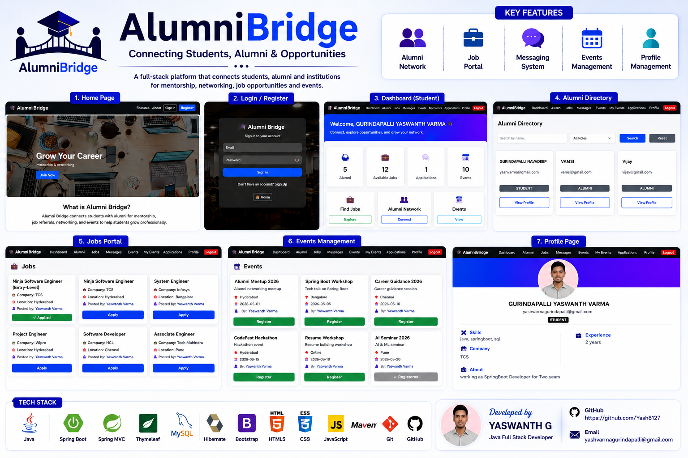
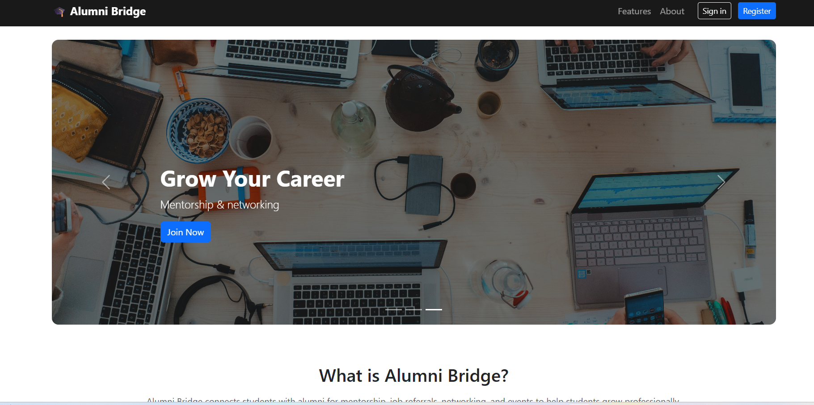
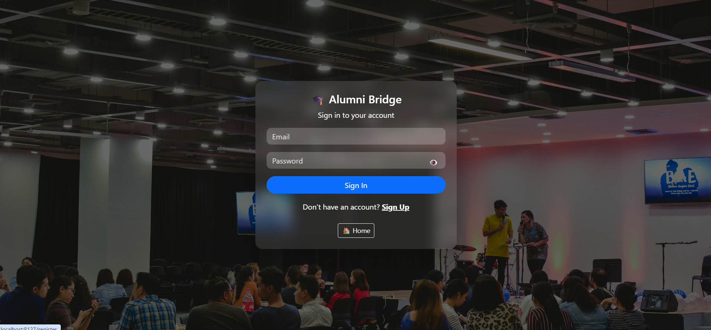
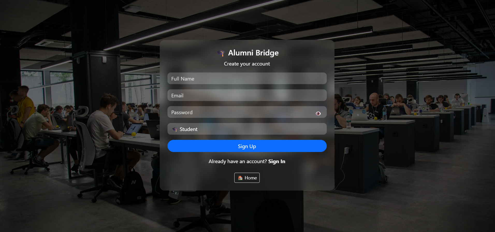
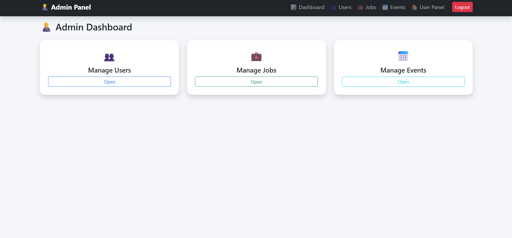
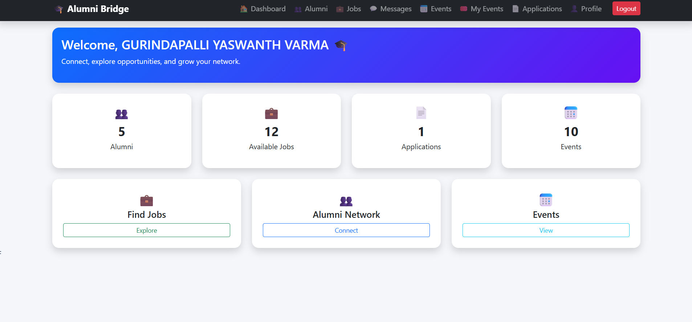
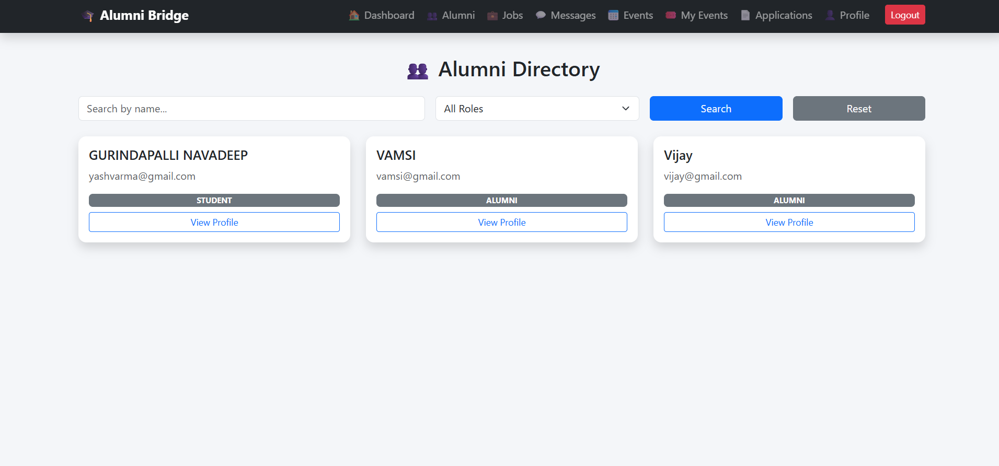
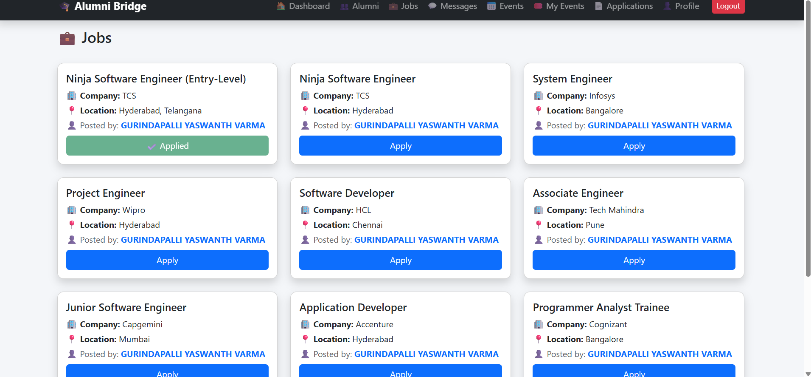
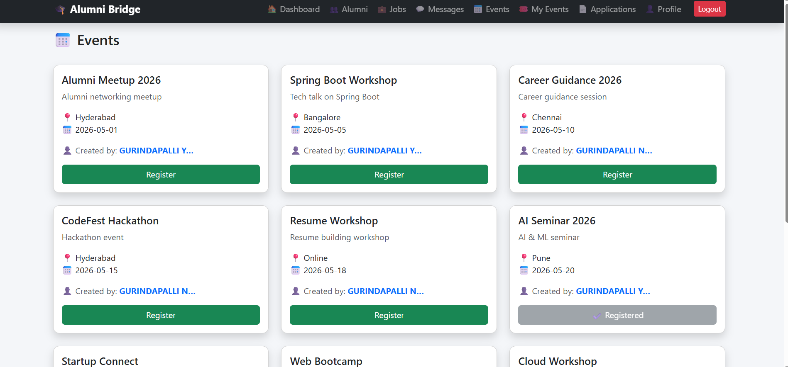
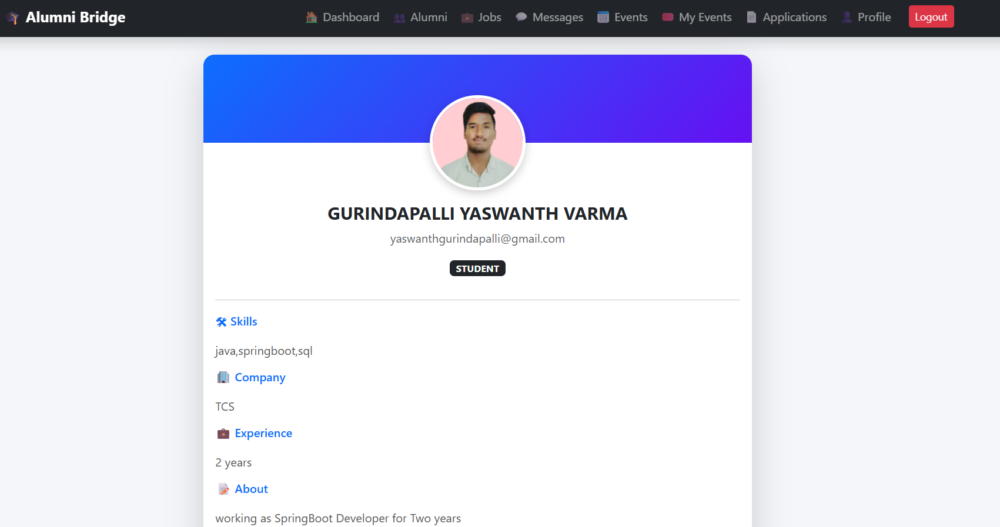

<div align="center">

# 🎓 AlumniBridge

### Connecting Students, Alumni & Opportunities

<p>
A modern <b>Spring Boot</b> web application designed to bridge the gap between students and alumni by enabling professional networking, career opportunities, event management, and seamless communication.
</p>

<p>


</p>

---

### 👨‍💻 Developed By

## **Gurindapalli Yaswanth Varma**

### Java Full Stack Developer

📧 **Email:** yashvarmagurindapalli@gmail.com

🔗 **GitHub:** https://github.com/Yash8127

</div>

---

# 📖 Project Overview

AlumniBridge is a full-stack web application developed to strengthen the relationship between alumni, students, and educational institutions through a centralized digital platform.

The application enables alumni and students to connect professionally, explore career opportunities, participate in events, communicate securely, and maintain professional profiles.

The system follows the Spring Boot MVC architecture with a layered design consisting of Controllers, Services, Repositories, and Entity classes, making the application modular, maintainable, and scalable.

---

# ✨ Key Features

## 🔐 Authentication

- Secure User Registration
- Secure Login
- Session Management
- Role-Based Authentication
- Admin Login
- Student/Alumni Login

---

## 👨‍🎓 Alumni Directory

- View Alumni Profiles
- Search Alumni
- Professional Networking
- Profile Details
- Alumni Information Management

---

## 💼 Job Portal

- Browse Jobs
- Apply for Jobs
- Post Jobs
- Manage Job Listings
- Application Tracking

---

## 📅 Event Management

- Create Events
- Register for Events
- View Upcoming Events
- Event Administration
- Event Registration Management

---

## 💬 Messaging Module

- Send Messages
- Receive Messages
- Inbox Management
- Alumni & Student Communication

---

## 👤 User Profile

- Personal Information
- Education Details
- Company Information
- Skills
- Experience
- Profile Picture
- Update Profile

---

## 👨‍💼 Admin Dashboard

- Dashboard Analytics
- User Management
- Job Management
- Event Management
- Application Management
- Complete Administrative Control

---

# 🛠️ Technology Stack

| Category | Technologies |
|----------|--------------|
| Programming Language | Java 21 |
| Backend Framework | Spring Boot |
| MVC Framework | Spring MVC |
| ORM Framework | Spring Data JPA (Hibernate) |
| Template Engine | Thymeleaf |
| Frontend | HTML5, CSS3, Bootstrap, JavaScript |
| Database | MySQL |
| Build Tool | Maven |
| IDE | Eclipse IDE |
| Version Control | Git |
| Repository | GitHub |

---

# 🏗️ System Architecture

```
                  Client Browser
                         │
                         ▼
                  Thymeleaf Views
                         │
                         ▼
                   Controllers
                         │
                         ▼
                     Services
                         │
                         ▼
                  JPA Repositories
                         │
                         ▼
                     MySQL Database
```

---

# 📂 Project Structure

```
AlumniBridge
│
├── src
│   ├── main
│   │
│   ├── java
│   │   └── com.alumnibridge
│   │       ├── config
│   │       ├── controller
│   │       ├── dto
│   │       ├── entity
│   │       ├── repository
│   │       └── service
│   │
│   └── resources
│       ├── static
│       ├── templates
│       └── application.properties
│
├── screenshots
│
├── pom.xml
│
└── README.md
```

---

# 📦 Project Modules

✅ Home Page

✅ About Page

✅ Features Page

✅ Login

✅ Registration

✅ User Dashboard

✅ Admin Dashboard

✅ Alumni Directory

✅ Job Portal

✅ Event Management

✅ User Profile

✅ Messaging

✅ Job Applications

---
# 🎯 Project Workflow

```text
                    User
                      │
                      ▼
          Login / Registration
                      │
        ┌─────────────┴─────────────┐
        ▼                           ▼
   Admin Dashboard            User Dashboard
        │                           │
        │                           │
        ▼                           ▼
 Manage Users                 View Alumni
 Manage Jobs                  Browse Jobs
 Manage Events                Apply Jobs
 Dashboard                    Register Events
                              Send Messages
                              Update Profile
```

---

# 📂 Package Structure

## 📌 Controller Layer

The controller layer handles all incoming HTTP requests and coordinates between the view and business logic.

| Controller | Responsibility |
|------------|----------------|
| AdminController | Admin dashboard and management |
| AlumniController | Alumni directory |
| AuthController | Login, Registration, Authentication |
| DashboardController | Dashboard operations |
| EventController | Event management |
| JobController | Job portal |
| MessageController | Messaging |
| ProfileController | User profile |

---

## ⚙️ Service Layer

The service layer contains the business logic of the application.

Examples include:

- User Authentication
- Job Management
- Event Registration
- Alumni Search
- Profile Management
- Messaging Services

---

## 🗄 Repository Layer

Spring Data JPA repositories responsible for database operations.

- UserRepository
- ProfileRepository
- JobRepository
- EventRepository
- ApplicationRepository
- EventRegistrationRepository
- MessageRepository

---

## 📦 Entity Layer

The project uses JPA entities mapped with MySQL tables.

| Entity | Description |
|---------|-------------|
| User | User authentication details |
| Profile | User profile information |
| Job | Job postings |
| Application | Job applications |
| Event | Event information |
| EventRegistration | Event registrations |
| Message | Messaging between users |

---

# 🗄 Database Design

The application uses **MySQL** as the relational database.

Main tables include:

- users
- profiles
- jobs
- applications
- events
- event_registrations
- messages

Spring Data JPA (Hibernate) is used for ORM and database interaction.

---

# ⚙ Installation Guide

## Prerequisites

- Java 21
- Maven
- MySQL
- Eclipse IDE
- Git

---

## Clone Repository

```bash
git clone https://github.com/Yash8127/AlumniBridge.git
```

---

## Import Project

Open Eclipse

↓

Import Existing Maven Project

↓

Select AlumniBridge

↓

Finish

---

## Configure Database

Create a MySQL database.

Example:

```sql
CREATE DATABASE alumnibridge_db;
```

Update your **application.properties**

```properties
spring.datasource.url=jdbc:mysql://localhost:3306/alumnibridge_db
spring.datasource.username=YOUR_USERNAME
spring.datasource.password=YOUR_PASSWORD
```

---

## Run Application

Run

```
AlumniBridgeApplication.java
```

Open

```
http://localhost:8080
```

---

# 🖥 Application Modules

## 🏠 Home Page

- Modern Landing Page
- Navigation Bar
- About Section
- Features
- Footer

---

## 🔐 Authentication

- Login
- Registration
- Secure Access
- Session Handling

---

## 👨‍🎓 Alumni Directory

- Browse Alumni
- Search Alumni
- View Details

---

## 💼 Job Portal

- Browse Jobs
- Post Jobs
- Apply
- Track Applications

---

## 📅 Events

- Create Events
- View Events
- Register
- Manage

---

## 💬 Messaging

- Inbox
- Send Messages
- Communication

---

## 👤 Profile

- Update Profile
- Education
- Experience
- Skills
- Company Details

---

## 👨‍💼 Admin Dashboard

- Dashboard
- Manage Users
- Manage Jobs
- Manage Events
- Monitor Applications

---

# 📸 Application Screenshots

Create a folder named

```
screenshots
```

and place your images like this.

```text
screenshots/
│
├── poster.png
├── home.png
├── features.png
├── login.png
├── register.png
├── admin-dashboard.png
├── user-dashboard.png
├── alumni-directory.png
├── jobs.png
├── events.png
├── profile.png
```

Display them in the README using:

# 🎨 Project Preview

## 📌 Promotional Poster



---


## 🏠 Home Page



---

## 🔐 Login



---

## 📝 Registration



---

## 👨‍💼 Admin Dashboard



---

## 👨‍🎓 User Dashboard



---

## 🎓 Alumni Directory



---

## 💼 Jobs



---

## 📅 Events



---

## 👤 Profile




---

# 🔒 Security Features

- Session Management
- Role-Based Authentication
- Input Validation
- JPA Repository Security
- MVC Architecture
- Layered Design

---

# 💡 Learning Outcomes

This project helped me strengthen my practical knowledge in:

- Spring Boot Development
- MVC Architecture
- Spring Data JPA
- Hibernate ORM
- MySQL Database Design
- Thymeleaf Template Engine
- Bootstrap UI Development
- JavaScript Integration
- Git & GitHub
- Software Project Structure
- CRUD Operations
- Authentication & Authorization

---
# 🚀 Future Enhancements

Although AlumniBridge already provides a comprehensive platform for students and alumni, several enhancements can further improve the application.

### Planned Features

- 📧 Email Notifications
- 🔑 Forgot Password & Password Reset
- 📱 Fully Responsive Mobile Design
- 📄 Resume Upload & Download
- 🔍 Advanced Search & Filters
- 📊 Admin Analytics Dashboard
- 📈 User Activity Reports
- 🌐 REST API Integration
- ☁ Cloud Deployment (AWS / Azure / Render)
- 🐳 Docker Support
- 🔔 Real-Time Notifications
- 💬 Real-Time Chat using WebSocket
- 📹 Alumni Mentorship Sessions
- 🎓 Alumni Success Stories
- 📅 Calendar Integration

---

# 📊 Project Highlights

✅ Developed using **Java 21** and **Spring Boot**

✅ Implemented **Spring MVC Architecture**

✅ Utilized **Spring Data JPA (Hibernate)** for database operations

✅ Responsive user interface built with **Bootstrap**

✅ Secure **Role-Based Authentication**

✅ Clean layered architecture

✅ Modular and scalable codebase

✅ Dynamic web pages using **Thymeleaf**

✅ Real-world CRUD operations

✅ Git version control with GitHub

---

# 🎯 Why AlumniBridge?

AlumniBridge was developed to strengthen the connection between students, alumni, and educational institutions.

The platform enables users to:

- Connect with alumni
- Explore career opportunities
- Participate in alumni events
- Build professional relationships
- Share knowledge and experiences
- Improve career guidance through networking

This project demonstrates practical implementation of enterprise-level concepts including authentication, layered architecture, ORM, and responsive UI development.

---

# 🧠 Skills Demonstrated

### Backend

- Java
- Spring Boot
- Spring MVC
- Spring Data JPA
- Hibernate
- REST-ready Architecture

### Frontend

- HTML5
- CSS3
- Bootstrap
- Thymeleaf
- JavaScript

### Database

- MySQL
- Entity Relationships
- CRUD Operations

### Tools

- Eclipse IDE
- Maven
- Git
- GitHub

### Concepts

- Object-Oriented Programming
- MVC Architecture
- Layered Architecture
- Authentication & Authorization
- Session Management
- Repository Pattern
- Dependency Injection

---

# 🌟 Project Impact

This project helped me gain practical experience in developing a real-world full-stack web application using the Spring ecosystem.

Throughout the development process, I improved my understanding of:

- Enterprise application architecture
- Database design
- Spring Boot development
- Frontend integration
- Clean code practices
- Version control with Git
- Problem-solving and debugging

---

# 🤝 Contribution

Contributions, suggestions, and feedback are always welcome.

If you have ideas for improving AlumniBridge:

1. Fork this repository.
2. Create a new feature branch.
3. Commit your changes.
4. Push the branch.
5. Open a Pull Request.

---

# 👨‍💻 About the Developer

## Gurindapalli Yaswanth Varma

**Java Full Stack Developer**

Passionate about building scalable, secure, and user-friendly web applications using modern Java technologies.

### Technical Interests

- Spring Boot
- Java Backend Development
- Full Stack Web Development
- REST APIs
- Database Design
- Software Architecture

---

# 📬 Contact

📧 **Email**

yashvarmagurindapalli@gmail.com

---

💻 **GitHub**

https://github.com/Yash8127

---

💼 **LinkedIn**

_Add your LinkedIn profile URL here_

Example:

https://www.linkedin.com/in/your-profile

---

# ⭐ Support

If you found this project useful, please consider giving it a **⭐ Star** on GitHub.

Your support motivates me to build and share more projects.

---

# 📄 License

This project is created for **learning, educational, and portfolio purposes**.

You are welcome to explore the codebase, learn from it, and adapt ideas for your own educational projects.

---

# 🙏 Acknowledgements

Special thanks to:

- Spring Boot Community
- Hibernate Documentation
- Bootstrap Team
- Thymeleaf Team
- MySQL Community
- Open Source Contributors

---

<div align="center">

## ⭐ Thank You for Visiting ⭐

### If you like this project, don't forget to ⭐ Star the repository.

**Happy Coding! 🚀**

Developed with ❤️ by **Gurindapalli Yaswanth Varma**

</div>
